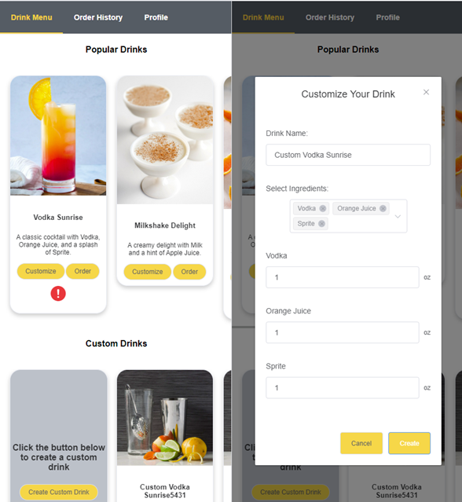
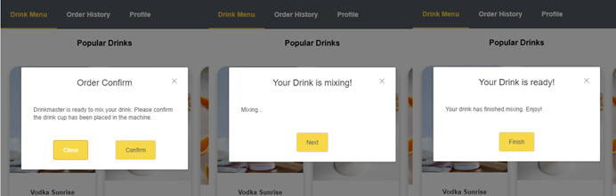
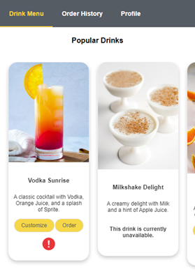
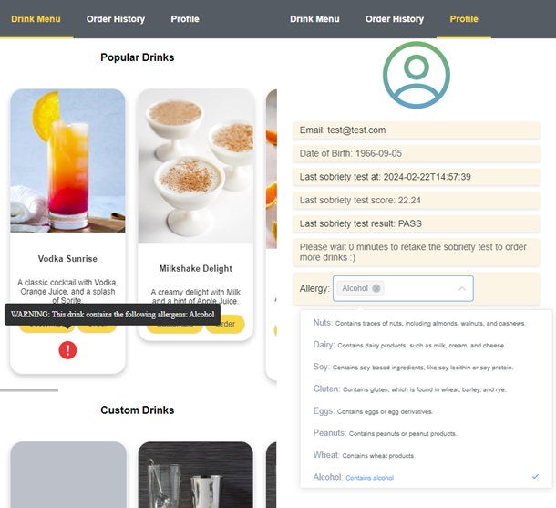
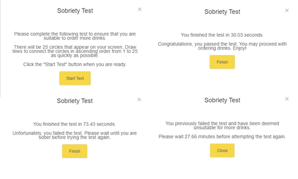
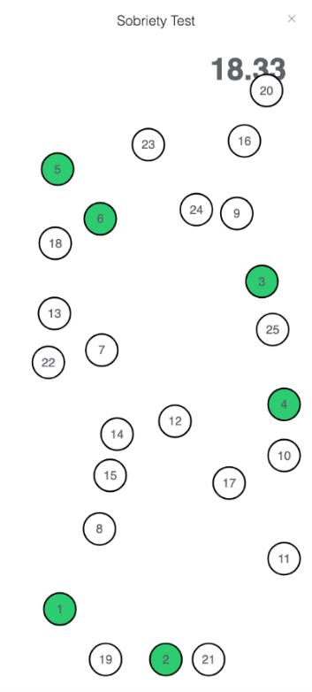

# drinkmaster-ui

## Overview
The Drinkmaster website provides a webpage for users to order drinks to be poured from the automated bartending machine. Users can order existing, popular drinks, or create their own drinks with customized ingredients. 







The application allows for users to specify their allergies so that they are notified whenever a drink contains that allergen. 



The user will be prompted to complete a test to ensure that they are sober enough to order more drinks every 30 minutes. This test involves tapping 25 circles in order from 1 to 25 as fast as possible.





## Project setup
```
npm install
```

### Compiles and hot-reloads for development
```
npm run serve
```

```
npm run dev
```

### Compiles and minifies for production
```
npm run build
```

### Tech Stack
...\drinkmaster-ui>node -v
v14.21.3

...\drinkmaster-ui>npm -v
6.14.18


### Customize configuration
See [Configuration Reference](https://cli.vuejs.org/config/).


